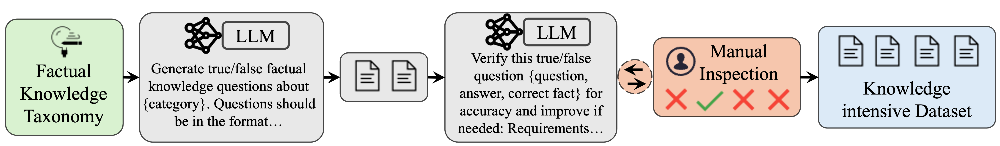
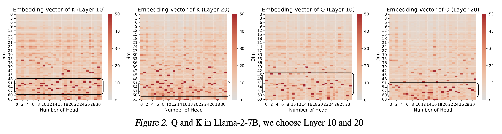
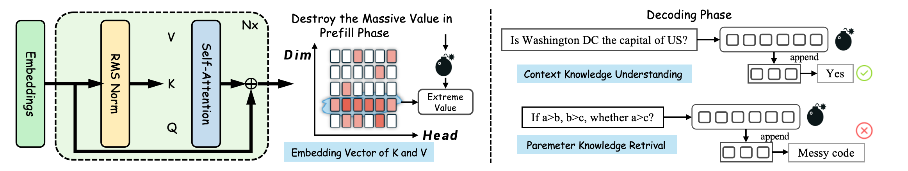

<h1 align="center">  🍊 Massive Values in Self-Attention Modules are the Key to Contextual Knowledge Understanding </h1>
<h3 align="center">  A comprehensive analysis of striped massive values appearing in attention Q and K matrices are mainly responsible for contextual knowledge understanding. </h3>

<p align="center">
  📃 <a href="https://arxiv.org/abs/2306.08018" target="_blank">Paper</a> 


## 🆕 News
- \[**Feb 2025**\] We submit the paper [Massive Values in Self-Attention Modules are the Key to Contextual Knowledge Understanding](https://github.com/zjunlp/MolGen), the striped massive values appearing in attention Q and K matrices are mainly responsible for contextual knowledge understanding, and this phenomenon originates from RoPE's effects on low-frequency channels.

## ❗Abstract
Our study systematically investigates **massive values** in LLMs' attention mechanisms. First, we observe massive values are concentrated in low-frequency dimensions across different attention heads exclusively in attention queries (Q) and keys (K) while absent in values (V). Besides, we find that these massive values are more responsible for understanding contextual knowledge (i.e., knowledge from context window) rather than retrieving parametric knowledge (i.e., knowledge from trained parameters) by extensive experiments. Further analysis of quantization methods shows that failing to protect massive values during quantization leads to more substantial performance degradation in contextual knowledge understanding, aligning with this observation. In addition, we analyze the root cause of the massive values and demonstrate that these massive values are induced by the mechanisms of RoPE (Rotary Positional Encoding) and that the values of low-frequency dimensions are less affected by position information. Our findings collectively uncover the functions of massive values in the Q and K, providing valuable insights for future model design and optimization strategies. 

<p align="center">
  
</p>

## 📝 How to run the Code

<h3 id="3-1"> 🤗 1. Environment Setting </h3>

```
>> conda create -n myenv python=3.9
>> conda activate myenv
>> pip install -r requirements.txt
```

<h3 id="3-2"> 📊 2. Passkey Retrieve Data Synthesis</h3>

```
>> bash scripts/run_passkey.sh 
```
#### Passkey Retrieval Data Synthesis Parameters：

\[**Core Parameters:**\]
- seq_length=128: Total length of the generated text sequence (must be ≥ 101)
- begin_pos=50: Starting position for password insertion
- passkey_length=6: Length of the password to be inserted

\[**Data Generation Controls:**\]
- num_gen_example=200: Number of examples to generate
- max_data_num=200: Maximum number of examples in the final dataset

> [!Note]
> To adjust the dataset size, both num_gen_example and max_data_num should be set to the same value. For example, to generate 300 examples, set both parameters to 300.

> [!Warning]
> Setting seq_length below 101 will result in an error.

```
pos_interval=500
begin_pos=50
seq_length=128
passkey_length=6
# Dataset Parameters
DATASET_CONFIG=(
    --dataset 'passkey_retrieval'
    --split 'test'
    --dataset_folder './synthetic_tasks'
    --num_gen_example 200
    --max_data_num 200
    --max_generation_length 10
)
```
You can find other datasets in datasets file.

<h3 id="3-3"> 📊 3. Knowledge QA Data Synthesis</h3>

The pipeline of knowledge QA data synthesis can be seen from the figure below.



```
>> bash scripts/run_knowledge_qa.sh 
```

The generated datasets are already available in the datasets folder.

You can also run the code in the datasets/create_knowledge_qa.py to customize the categories and number of knowledge QA pairs.

```
>> python datasets/create_knowledge_qa.py --category <YOUR_CATEGORY> --num_pairs <YOUR_NUM_PAIRS>
```

\[**Core Parameters:**\]
- categories: The categories of the generated knowledge QA pairs
- num_pairs: The number of knowledge QA pairs to be generated


<h3 id="3-4"> 4. 🎯 Get the Embedding Vector in different LLMs </h3>

```
>>  sh scripts/save_attn_map.sh 
```

**Step 1**, pattern="save_attn", select a language model like meta-llama/Llama-2-7b-chat-hf

```shell
>> CUDA_VISIBLE_DEVICES=0 python llm_example_save_attn.py \
    --model_name meta-llama/Llama-2-7b-chat-hf\
    --pattern "$pattern" \
    --round "$round" \
```
**Step 2:** How to choose layers in different LLM

For example, in **Llama🦙**

Find modeling_llama.py and search the code below. Then you can change the code: ```if GLOBAL_L == 1 or GLOBAL_L == 2 or GLOBAL_L == 10:```, choose the layer ```GLOBAL_L``` you want.
```
global GLOBAL_L

head_set = range(32)

if GLOBAL_L in range(32):
    if not os.path.exists(save_dir):
        os.makedirs(save_dir)

    if GLOBAL_L == 1 or GLOBAL_L == 2 or GLOBAL_L == 10:
        print(query_states.shape)
        torch.save(query_states, f"{save_dir}/q_merged_attn_weights_layer{GLOBAL_L}.pt")
        torch.save(key_states, f"{save_dir}/k_merged_attn_weights_layer{GLOBAL_L}.pt")
        torch.save(value_states, f"{save_dir}/v_merged_attn_weights_layer{GLOBAL_L}.pt")
                
```

**Step 3:** Use attn.ipynb or appendix_result/run.ipynb to show the result.


<h3 id="3-5"> 5. 🔬 Massive Value Destruction: Replicating Contextual Knowledge Understanding Experiments </h3>



```
>>  sh scripts/save_attn_map.sh 
```
\[**Core Parameters**\]: use different model by **model_name** like meta-llama/Meta-Llama-3-8B-Instruct, meta-llama/Llama-2-7b-chat-hf, mistralai/Mistral-7B-Instruct-v0.3, Qwen/Qwen2.5-7B-Instruct, google/gemma-2-9b-it, facebook/opt-2.7b, ai21labs/Jamba-v0.1, Qwen/Qwen2-VL-2B-Instruct
```
pattern="save_attn"
round=2

CUDA_VISIBLE_DEVICES=0 python llm_example_save_attn.py \
    --model_name meta-llama/Llama-2-7b-chat-hf\
    --pattern "$pattern" \
    --round "$round" \
    #2>&1 | tee ./imdb_destroy.log      
```
